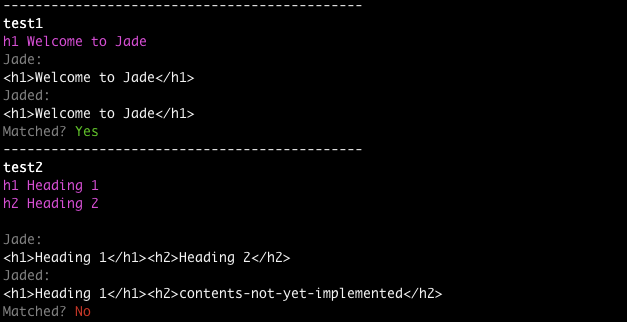

# ucdd-jaded

UCDD II class's effort to re-implement the jade template engine

# Install

	$ npm install
	
# Usage

```
var jaded = require('./lib/jaded')

var tree = {
    "type": "Block",
    "children": [{
        "type": "Tag",
        "name": "h1",
        "text": "Welcome to Jaded"
    }]
}

jaded.render(tree)
// --> <h1>Welcome to Jaded</h1>
```
	
# Development

* <code>lib/jaded.js</code>: main library that provides the <code>render()</code> function
* <code>lib/[tag-name].js</code>: a generator function for a HTML tag. For example, 
	* <code>lib/h1.js</code> is a generator function for <code>h1</code>
	* <code>lib/a.js</code> is a generator function for <code>a</code>


# Test

	$ node test.js



# Test Templates

In <code>templates/</code>, there are several jade template files (.jade) for testing. 

In this assignment, you don't need to worry about parsing the template file into a workable format. This has been done for you. Each template file has been parsed and converted into a tree structure, which is stored as a JSON file in the same directory.

Take <code>test3</code> as an example, the Jade template file is <code>templates/test3.jade</code>

```
div
	h1.title UCDD 2 Spring 2015

```

A tree data structure obtained by parsing <code>test3.jade</code> is saved as <code>templates/test3.json</code>

```
{
 "type": "Block",
 "children": [
  {
   "type": "Tag",
   "name": "div",
   "children": [
    {
     "type": "Tag",
     "name": "h1",
     "attrs": [
      {
       "name": "class",
       "val": "'title'"
      }
     ],
     "text": "UCDD 2 Spring 2015"
    }
   ]
  }
 ]
}

```

